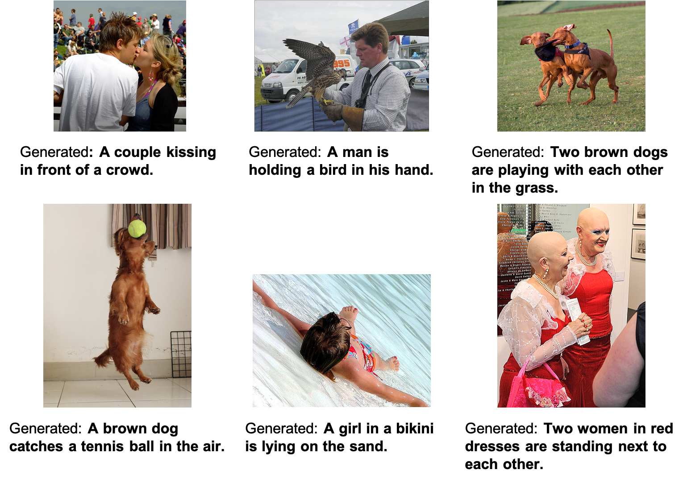
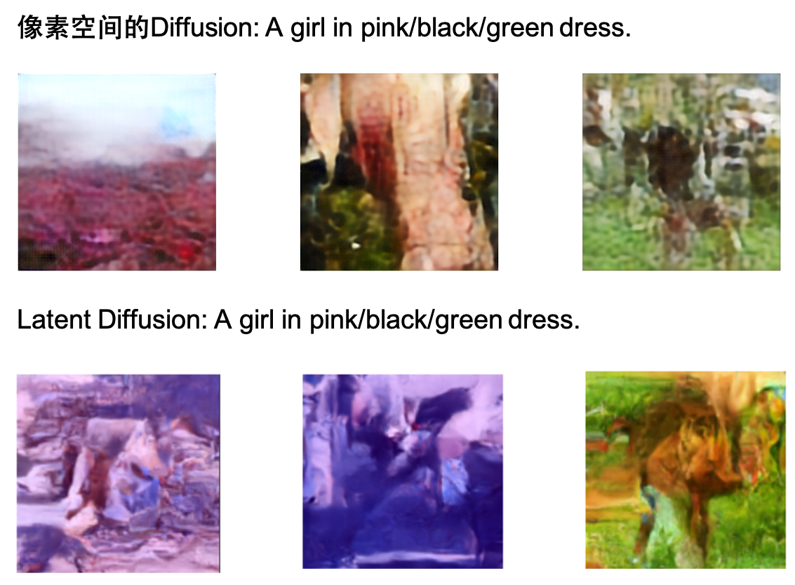
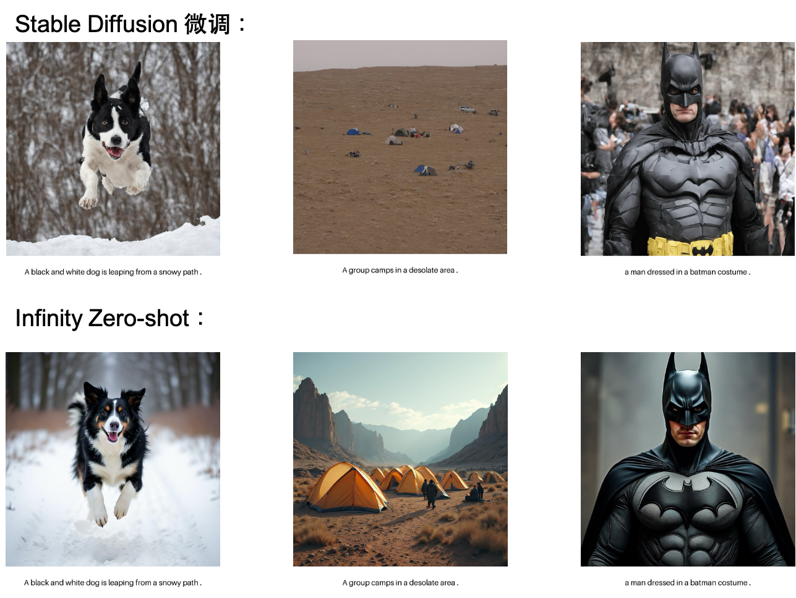

# 中国人民大学2024《多模态机器学习》期末课程作业

我们在Flickr8k数据集上进行四组图生文模型实验和四组文生图模型实验。

## 图生文模型
我们进行了以下四组图生文模型实验：
1. ResNet-18 + Cross Attention + Transformer Decoder 
2. CLIP(ViT-B/32) + Cross Attention + Transformer Decoder 
3. CLIP(ViT-g/14) + Q-former + BERT
4. CLIP(ViT-g/14) + Q-former + TinyLlama-1.1B

四组实验的结果如下：Q-former + TinyLlama-1.1B模型在4项BLEU指标上取得了最好的效果。
| 视觉编码器        | 模态对齐模块     | 文本解码器            | BLEU1 | BLEU2 | BLEU3 | BLEU4 |
|--------------------|------------------|-----------------------|-------|-------|-------|-------|
| ResNet-18         | Cross Attention | Transformer Decoder  | 22.7  | 13.9  | 8.7   | 5.2   |
| CLIP(ViT-B/32)    | Cross Attention | Transformer Decoder  | 23.3  | 15.5  | 10.2  | 6.2   |
| CLIP(ViT-g/14)    | Q-former        | BERT                 | 52.3  | 36.7  | 24.7  | 15.8  |
| CLIP(ViT-g/14)    | Q-former (预训练) | TinyLlama-1.1B      | **72.2**  | **50.9**  | **36.1**  | **25.9**  |

Q-former + TinyLlama-1.1B生成的部分文如下图所示

## 文生图模型
我们进行了以下四组文生图模型实验：
1. 对Stable Diffusion进行微调
2. 使用Infinity Model进行zero-shot生成
3. 在原图上训练Diffusion Model
4. Latent Diffusion Model

以下我们展示四组实验生成的部分图像：

